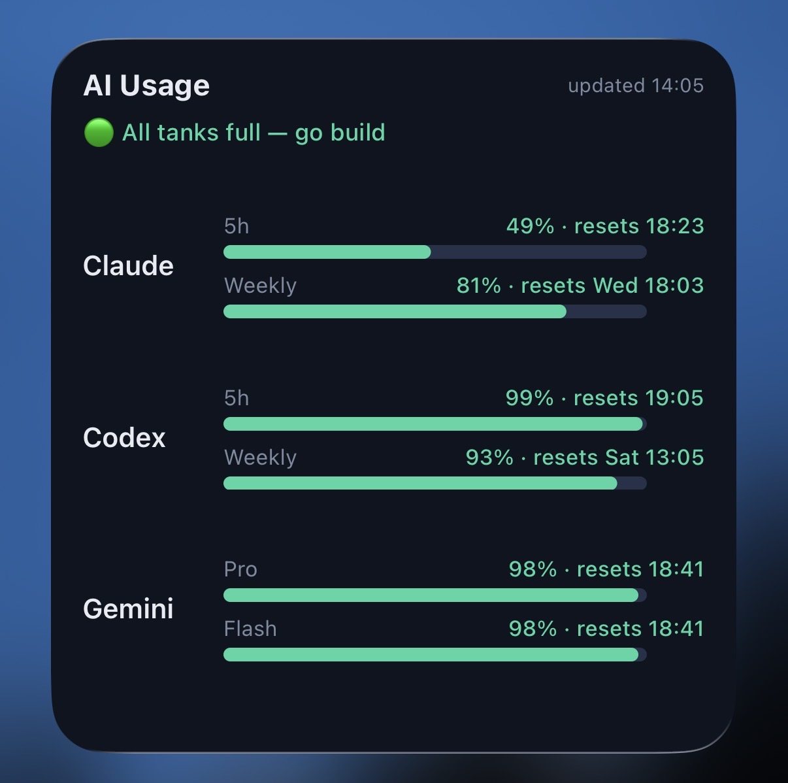
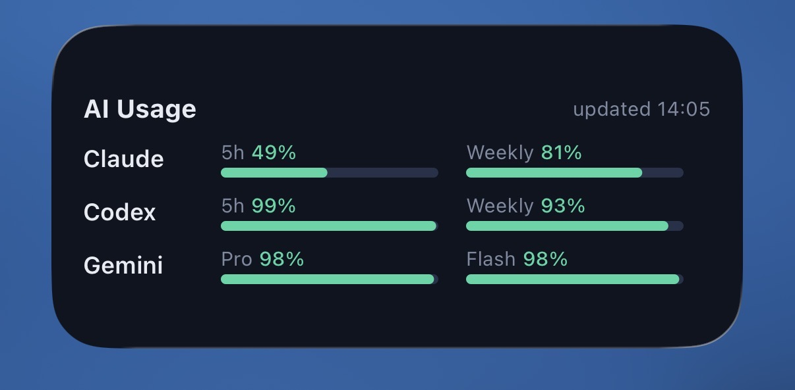

# AI Usage Dashboard

[English](README.md)

这个开源项目把 **Claude Code、Codex on ChatGPT 和 Google Antigravity CLI** 的剩余用量集中显示在 Mac 网页和 iPhone 桌面小组件中。

项目只读取各官方 CLI 已保存在 Mac 上的登录凭证。凭证不会发送到手机或由本项目上传。手机只接收用量结果，并保存最后一次成功快照；Mac 关机后，小组件会明确标注 `cached` 和缓存时间，不会把旧数据伪装成实时数据。

## 效果示例

| 详细视图 | 紧凑小组件 |
| --- | --- |
|  |  |

## 工作方式

Mac 从已经登录的 AI 命令行工具采集用量，并只在本机 `127.0.0.1` 提供服务。Tailscale Serve 为 iPhone 提供私有 HTTPS 地址；Scriptable 将结果显示为桌面小组件，并通过 iCloud 保存最后一次成功结果。

## 首次准备

1. 使用 macOS，并确保已经安装 Python 3。
2. 至少安装并登录 Claude Code、Codex 或 Google Antigravity 中的一个。
3. 在 Mac 和 iPhone 安装 Tailscale，登录同一个账户，并确认两台设备均已连接。
4. 在 iPhone 安装 Scriptable。
5. 打开 iPhone 的「设置 → Apple 账户 → iCloud → 查看全部」，启用 Scriptable；然后至少打开一次 Scriptable，让它创建 iCloud 文件夹。

## 一键安装

在 Mac 终端运行：

```bash
curl -fsSL https://raw.githubusercontent.com/XinyuIvy/ai-usage-check/main/install.sh | bash
```

然后运行自动诊断：

```bash
~/.local/bin/ai-usage-check doctor
```

安装程序会下载应用、设置登录后自动启动、配置每日更新、创建 Tailscale 私有地址，并把 `AI Usage.js` 写入 Scriptable 的 iCloud 文件夹。正常网络下一般不到一分钟。如果 Tailscale 无响应，安装程序会在八秒后停止等待并完成本地安装，不会无限卡住。

## iPhone 最后一次手动设置

iOS 不允许程序自动添加桌面小组件，因此首次需要手动完成：

1. 长按 iPhone 主屏幕，点击 `+`。
2. 添加 Scriptable 小组件，建议选择中号。
3. 长按新小组件，选择「编辑小组件」。
4. 将 Script 设为 `AI Usage`。

完成一次后，Widget 代码更新、服务器地址、网络切换和离线缓存都自动处理。

如果安装时 Scriptable 还没有准备好，之后运行：

```bash
~/.local/bin/ai-usage-check widget
```

## 自动功能

- Mac 登录后自动启动，服务崩溃后自动重启。
- Mac 程序每天自动检查更新。
- Scriptable loader 每天检查 Widget 新版本，并保留可用旧版以便失败回退。
- 更换 Wi-Fi 不会改变 Tailscale 私有地址。
- Mac 关机后显示最后一次缓存及其时间。
- Mac 恢复在线后自动切回实时数据。

## 常用命令

```bash
ai-usage-check status
ai-usage-check doctor
ai-usage-check open
ai-usage-check restart
ai-usage-check update
ai-usage-check widget
ai-usage-check logs
ai-usage-check uninstall
```

如果终端找不到 `ai-usage-check`，请使用完整路径 `~/.local/bin/ai-usage-check`。

## 常见问题

- 某个平台出现 `HTTP 429`：该平台暂时限制了过于频繁的请求，不代表安装失败；其他平台仍可正常显示，稍后重试即可。
- 安装提示 Tailscale 无响应：打开 Tailscale 并重新连接，然后运行 `~/.local/bin/ai-usage-check widget`。
- Mac 本地页面正常、手机无法访问：确认两台设备的 Tailscale 均已连接，并检查 Scriptable Widget 选择的是 `AI Usage`。
- Scriptable 中没有 `AI Usage`：确认已为 Scriptable 开启 iCloud，打开一次 App，再运行 Widget 安装命令。
- 查看后台错误：运行 `~/.local/bin/ai-usage-check logs`。

## 隐私与限制

- 项目不会把 AI 登录凭证复制到手机。
- 不要使用 Tailscale Funnel 或路由器端口转发把服务暴露到公网。
- iOS 决定小组件刷新时间，因此显示接近实时，但不是持续刷新。
- Mac 关机时无法采集新数据，只能显示缓存。
- 项目通过 [cclimits](https://github.com/cruzanstx/cclimits) 使用未公开的用量接口；平台改变接口后，采集功能可能需要更新。

开发与安全说明见 [CONTRIBUTING.md](CONTRIBUTING.md) 和 [SECURITY.md](SECURITY.md)。项目使用 MIT License。
